# Welcome To OA's 數字翻轉計數器!
嗯，就是一個數字翻轉計數器！

---
## 聲明
本作品授權採用 姓名標示-非商業性 2.0 台灣 (CC BY-NC 2.0 TW) 授權，詳見 [http://creativecommons.org/licenses/by-nc/2.0/tw/](http://creativecommons.org/licenses/by-nc/2.0/tw/)

 
## DEMO
LIVE DEMO：[https://works.ioa.tw/number_flipping_counter/index.html](https://works.ioa.tw/number_flipping_counter/index.html)

 
## 簡介
* 使用簡單的 JavaScript 與 SCSS 實作數字翻轉計數器，藉由設定每個計數器元素的 class 來達成不同數字的顯示，分別以 n0~n9 的 class 來設定子元素 top 的位置。

 
## 說明

* 首先建立要用的 HTML 結構，基本上就是 span 代表一個位數，裡面的 i 代表 10 個數字。

	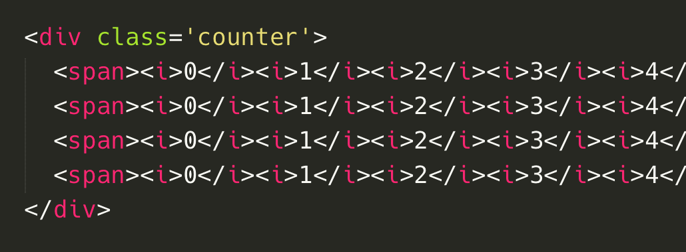
	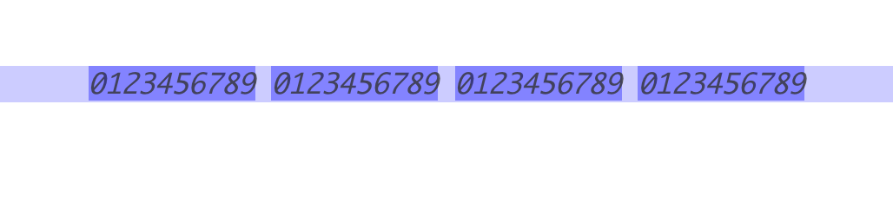

* 設定 scss(css)，將 span 給予 `position: relative;` 的屬性，然後針對子元素 i 設定 `position: absolute;`，此時看到瀏覽器畫面 span 內的 i 都疊在一起了。

	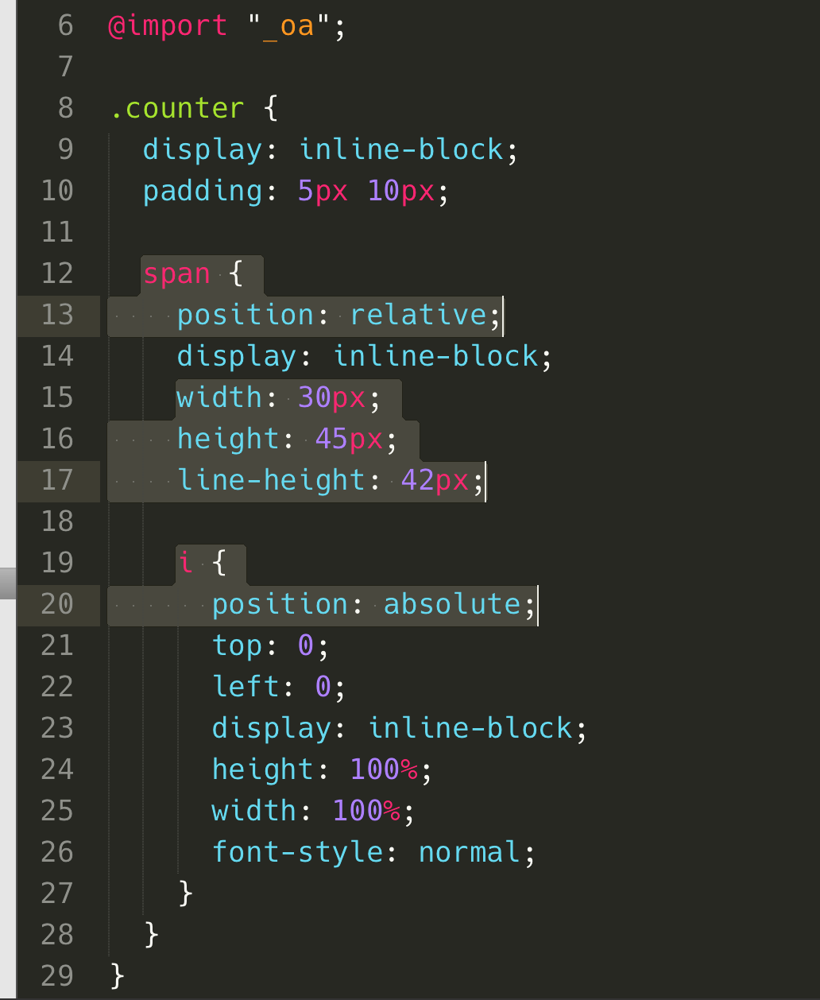
	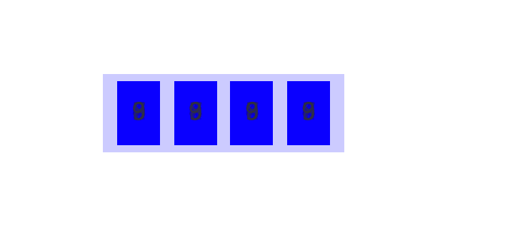

* 利用 scss 的 **for** 迴圈，針對 **nth-child** 設定 **top** 的位置。瀏覽器使用開發者檢視，可以發現每個 i 都因為 for 迴圈加上使用 calc，所以有不同的設定值。
	
	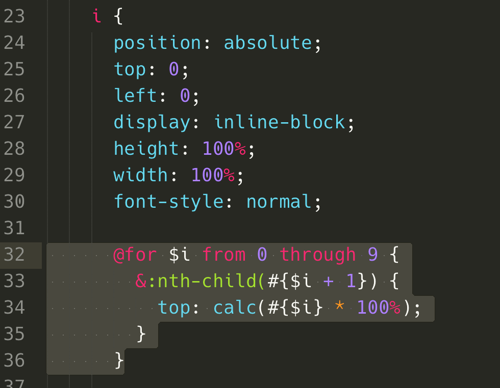
	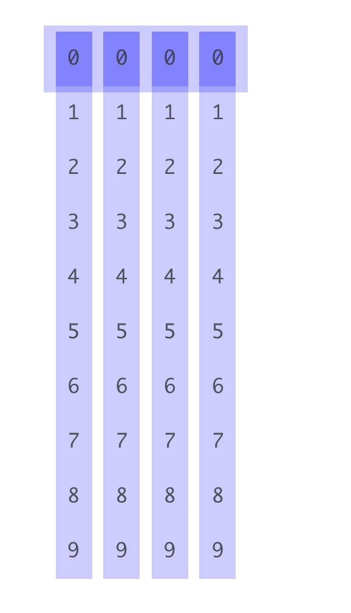
	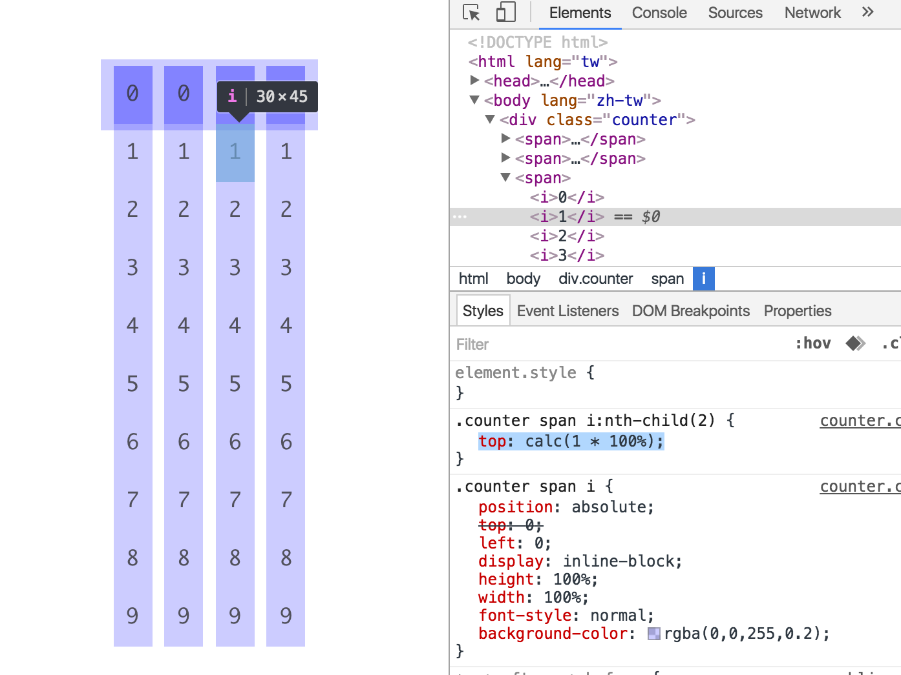
	
* 接著改變一下 HTML，將每個 span 加上 n5 的 class，並且修改 scss，將原本的 for 迴圈移除，改在 span 設定，使用雙層迴圈，分別針對 n0~n9 去設定 i 的不同位置。開啟瀏覽器，可以發現 i 被移到指定的 5。

	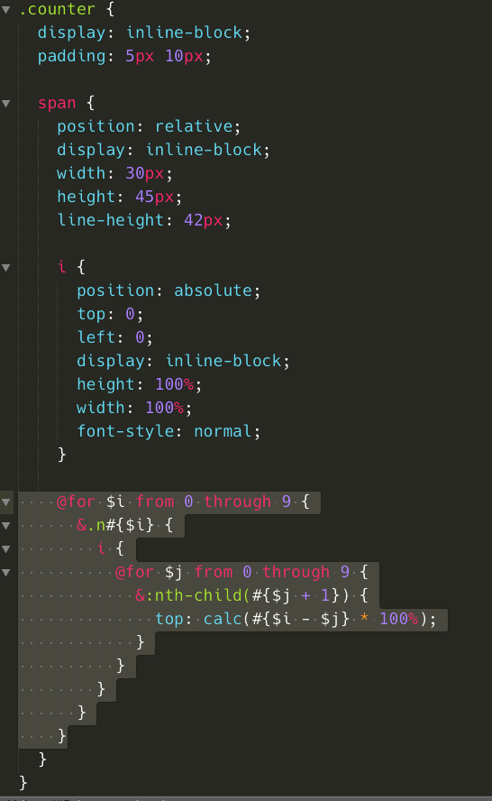
	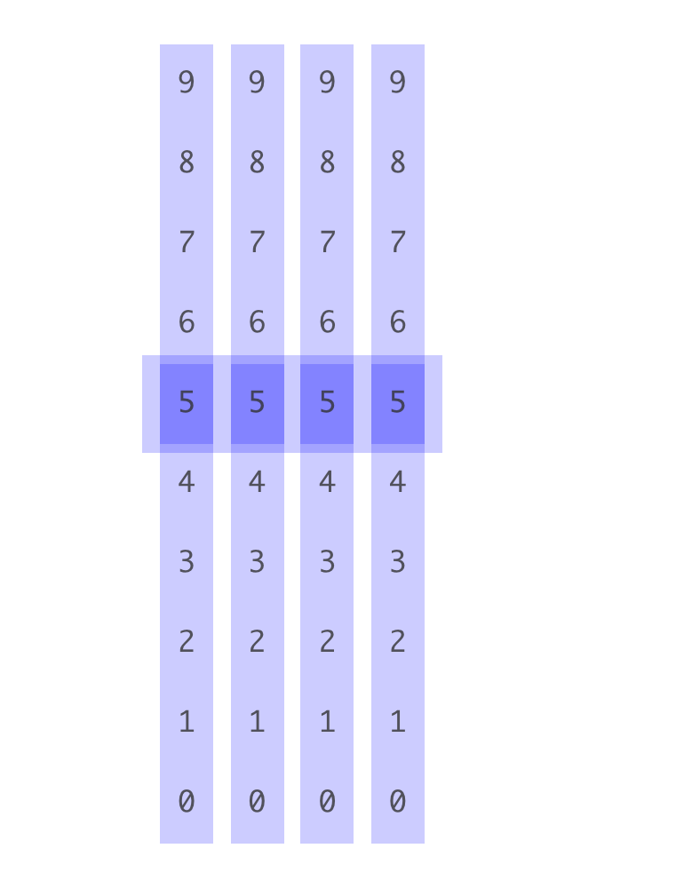
	
* 使用 JavaScript 輔助，使用簡單的數學運算(/、%、pow)，切割出各個位數，並且利用 jQuery 的 **eq** 來取得指定的 span。

	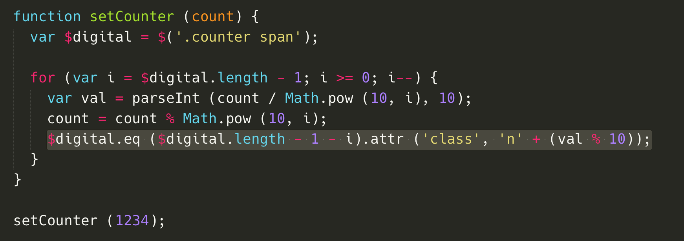
	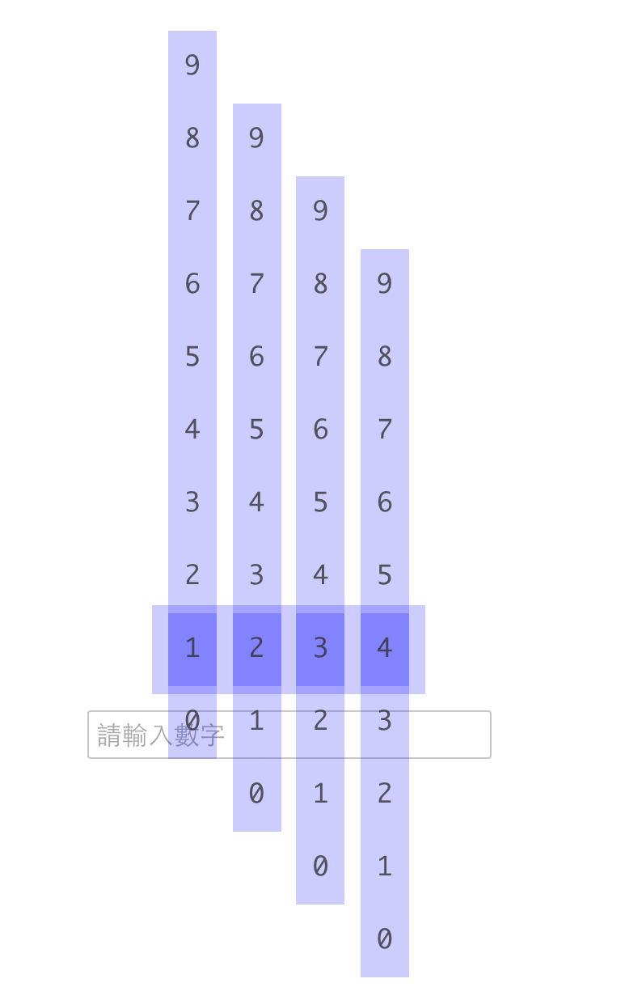

* 加上個 input，並且修改一下 JavaScript，讓使用者輸入數字時改變計數器。

	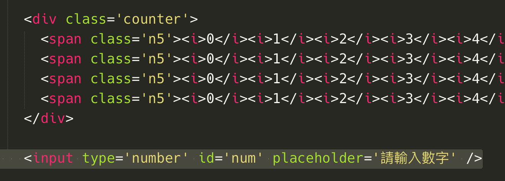
	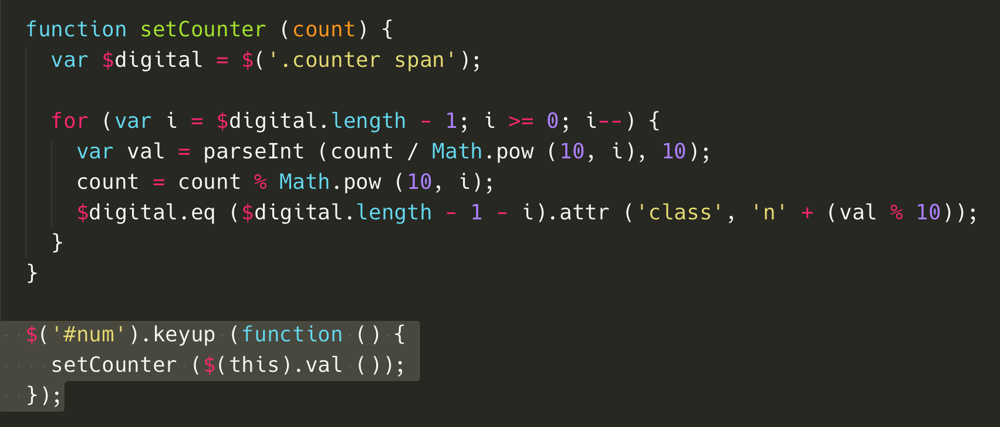
	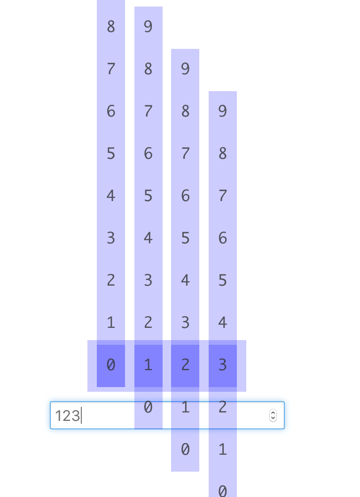

* 最後在 span 上加入 `overflow: hidden;`，如此就可以將不再位置內的 i 隱藏囉！同時 i 加上 transition 優化 top 移動的效果！

	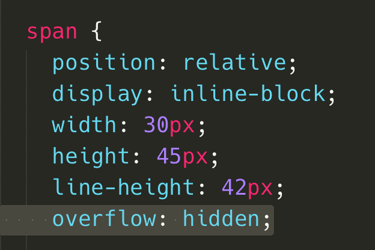
	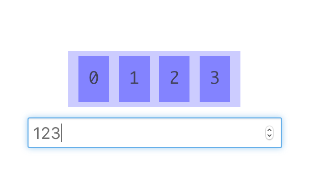
	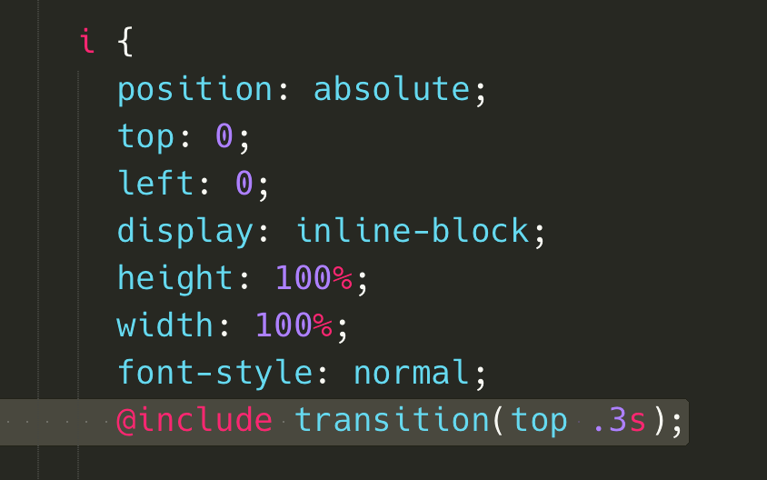
